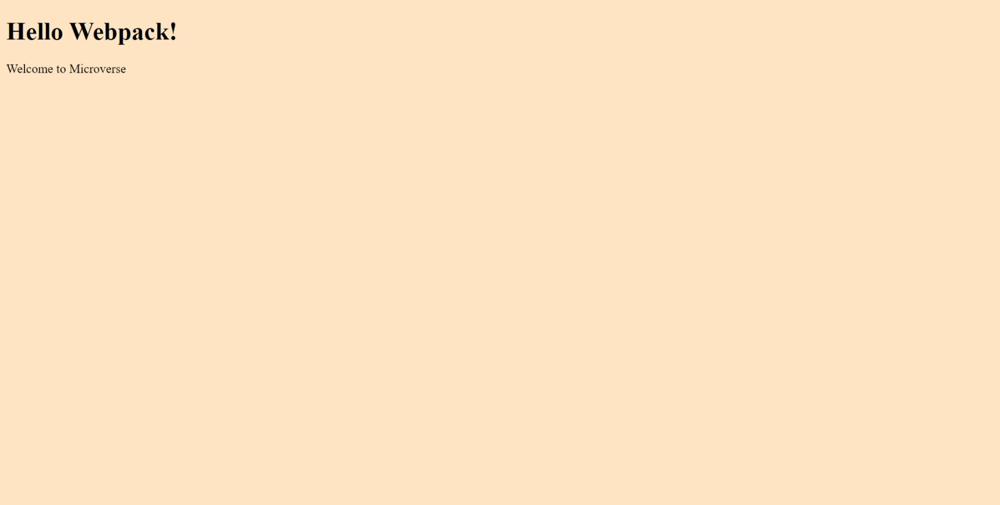

# Leaderboard


> The leaderboard website displays scores submitted by different players.



The leaderboard website displays scores submitted by different players. It also allows you to submit your score. All data is preserved thanks to the external [Leaderboard API service](https://www.notion.so/microverse/Leaderboard-API-service-24c0c3c116974ac49488d4eb0267ade3).

## Built With

- HTML
- CSS
- JavaScript

## Live Demo

[Live Demo Link](https://livedemo.com)

## Getting Started

To get a local copy up and running follow these simple example steps.

### Prerequisites

- NodeJS - [v16.x](https://nodejs.org/en/)

### Setup

```bash
git clone https://github.com/usmansbk/leaderboard.git
cd ./leaderboard
```

### Install

```bash
npm install
```

### Usage

```bash
npm start
```

### Build

```bash
npm run build
```

### Run tests

```bash
npm test
```

## Authors

👤 **Babakolo Usman Suleiman**

- GitHub: [@usmansbk](https://github.com/usmansbk)
- LinkedIn: [LinkedIn](https://www.linkedin.com/in/usman-suleiman-82b444140/)

## 🤝 Contributing

Contributions, issues, and feature requests are welcome!

Feel free to check the [issues page](../../issues/).

## Show your support

Give a ⭐️ if you like this project!

## Acknowledgments

- Microverse
- [Leaderboard API Service](https://www.notion.so/microverse/Leaderboard-API-service-24c0c3c116974ac49488d4eb0267ade3)

## 📝 License

This project is [MIT](./MIT.md) licensed.
